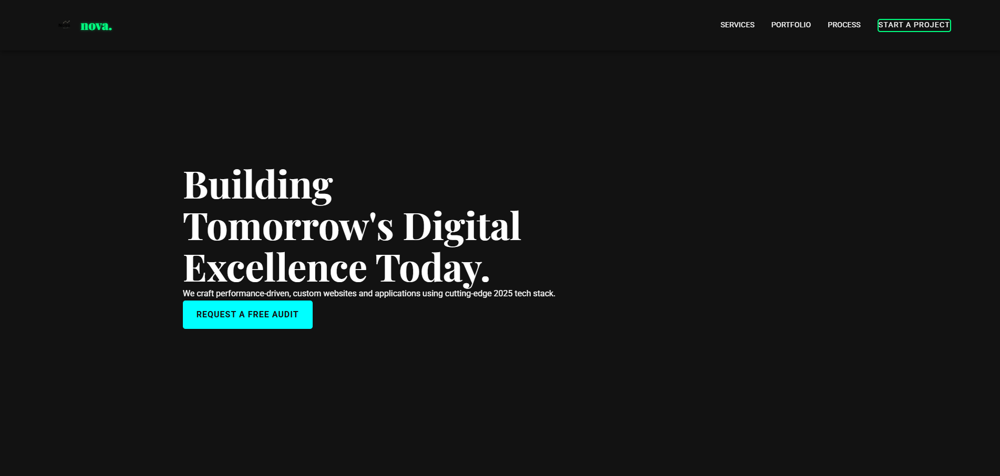

 nova. - Digital Excellence Web Agency

A modern, performance-driven website for a digital agency specializing in custom web development and cutting-edge tech solutions.

 

 🎯 About

nova. is a professional web presence showcasing digital expertise, services, and portfolio projects. Built with clean, modern design principles and optimized for performance.

 📁 Project Structure

```
nova.web/
├── index.html               Homepage
├── services.html            Services overview
├── portfolio.html           Portfolio/case studies
├── process.html             Development process
├── blog.html                Blog page
├── careers.html             Careers page
├── faq.html                 FAQ page
├── privacy.html             Privacy policy
├── terms.html               Terms of service
│
├── ascend-wealth.html       Case study: Ascend Wealth
├── vortex-retail.html       Case study: Vortex Retail
├── quantify-data.html       Case study: Quantify Data
│
├── netlify.toml             Netlify deployment configuration
├── css/
│   └── style.css            Main stylesheet
├── js/
│   └── main.js              Main JavaScript
└── assets/
    └── img/
        ├── logo.svg         nova. logo
        ├── hero-visual.png  Hero section image
        ├── facebook.svg     Social icon
        ├── instagram.svg    Social icon
        └── x.svg            Social icon
```

 🎨 Features

- Responsive Design - Mobile-first approach, works on all devices
- Modern Technology - Built with HTML5, CSS3, and JavaScript (vanilla)
- SEO Optimized - Semantic HTML and proper meta tags
- Accessibility - ARIA labels and semantic structure
- Smooth Animations - AOS (Animate On Scroll) library integration
- Professional Typography - Google Fonts (Roboto & Playfair Display)
- Contact Forms - Netlify Forms integration for submissions

 🚀 Getting Started

 Prerequisites
- A modern web browser
- A code editor (VS Code, etc.)
- Basic knowledge of HTML/CSS/JavaScript

 Installation

1. Clone or download the repository
2. Open the project folder in your code editor
3. Use a local server to serve the files (recommended):
   ```bash
    Using Python
   python -m http.server 8000
   
    Using Node.js (with http-server)
   npx http-server
   ```
4. Navigate to `http://localhost:8000` in your browser

 🌐 Deployment

This project is configured for Netlify deployment:

- Configuration file: `netlify.toml`
- Base directory: `/` (root)
- Publish directory: `/` (entire project)
- Build command: None (static site)
- Forms are handled via Netlify Forms

To deploy:
1. Push your repository to GitHub
2. Connect to Netlify
3. Configure build settings (already set in `netlify.toml`)
4. Deploy!

 📄 Pages

| Page | Purpose |
|------|---------|
| `index.html` | Main landing page with hero section and services overview |
| `services.html` | Detailed service offerings |
| `portfolio.html` | Portfolio grid with case studies |
| `process.html` | Development process and methodology |
| `blog.html` | Blog articles and insights |
| `careers.html` | Job openings and career information |
| `faq.html` | Frequently asked questions |
| `privacy.html` | Privacy policy |
| `terms.html` | Terms of service |
| `ascend-wealth.html` | Case study: Ascend Wealth project |
| `vortex-retail.html` | Case study: Vortex Retail project |
| `quantify-data.html` | Case study: Quantify Data project |

 🛠️ Technologies Used

- HTML5 - Semantic markup
- CSS3 - Modern styling and animations
- JavaScript - Interactive features
- Google Fonts - Professional typography (Roboto, Playfair Display)
- AOS Library - Scroll animations
- Netlify - Hosting and forms

 📞 Contact & Navigation

- Main Navigation - Services, Portfolio, Process
- CTA Button - "Start a Project" and "Request a Free Audit"
- Contact Form - Handled via Netlify Forms
- Social Links - Facebook, Instagram, X (Twitter)

 🎯 Key Sections

 Hero Section
Eye-catching headline with call-to-action

 Services Section
Core expertise highlights with service cards

 Portfolio Section
Showcase of completed projects and case studies

 Process Section
Methodology and approach explanation

 📝 Notes

- Favicon is expected at `favicon.ico` (root directory)
- All images are in `assets/img/`
- Main styling is centralized in `css/style.css`
- JavaScript functionality in `js/main.js`
- Mobile menu toggle functionality for responsive navigation

 🔗 External Dependencies

- [Google Fonts](https://fonts.google.com/)
- [AOS - Animate On Scroll](https://michalsnik.github.io/aos/)
- [Netlify Forms](https://www.netlify.com/products/forms/)

 📄 License

This project's license information would typically be specified here.

 ✍️ Author

Digital agency web presence

---

Last Updated: December 2025
